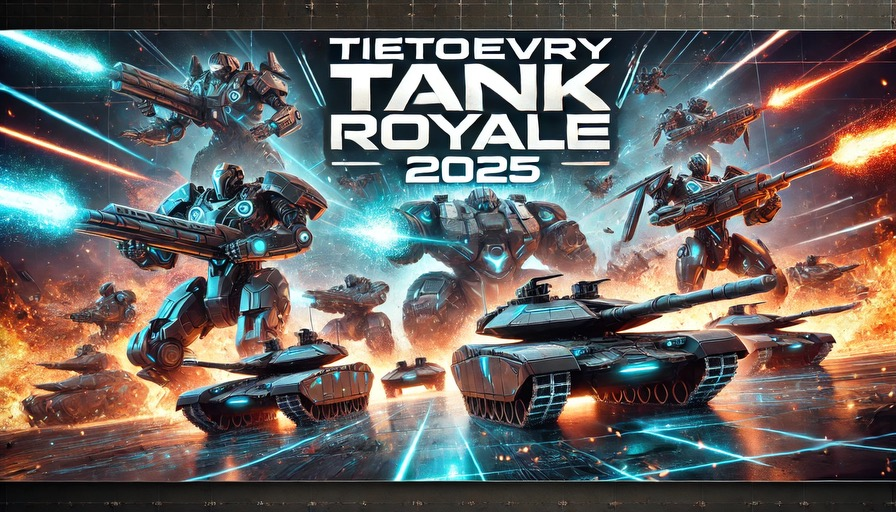
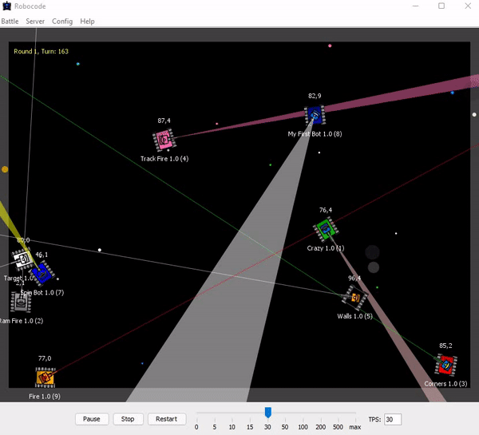
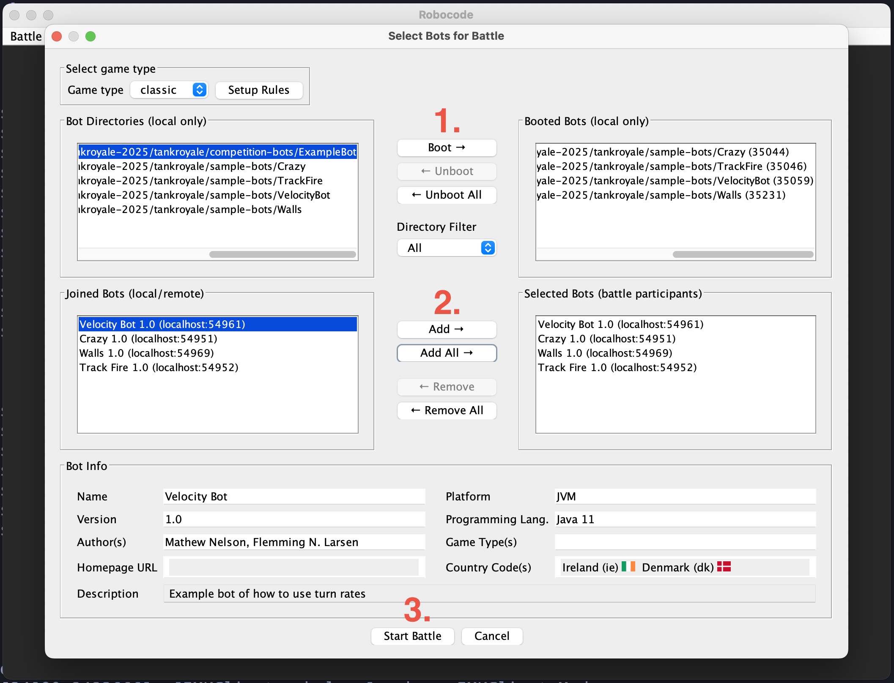

# Faggruppe, Utvikling -- Tank Royale 2025 

## Introduction

[Tank Royale (Robocode)](https://robocode-dev.github.io/tank-royale/articles/intro.html) is a programming game where the goal is to code a bot in the form of a tank to compete against other bots in a virtual battle arena. Once the match starts you will have no control over your bot and its performance relies solely on the quality of your implementation.

## Prerequisites

Robocode is running on the Java Runtime Environment (JRE) and needs Java 11 as a minimum. Run `java -version` to check your current Java version.

## Getting Started

In order for you to participate in the Tank Royale you need to do the following:

1. Clone this repository
2. Copy and rename the ExampleBot in the **tankroyale/competition-bots** subdirectory. Note that the new directory as well as all of the files in it should have the exact same name. 
3. Modify the values inside the `YOUR_BOT_NAME.json` file
4. Create a feature branch for your new bot
5. Create a PR to the `main` branch containing __only__ the files in your bot directory

## Developing your bot

Read the docs at _docs/javadoc/index.html_! You should start by exploring the `Robot` class (your bot is a subclass of this), which contains methods for moving the bot, turning the turret, firing bullets etc.

TIP! Check the source code of some of the sample bots for inspiration if you are stuck. 

### Things to note
- Firing your turret drains your own energy (health), as does colliding into walls and other bots
- Avoid calling API methods like `fire()` and in general avoid CPU-intensive logic in your event handlers (why? read [here](https://robocode-dev.github.io/tank-royale/tutorial/beyond-the-basics.html#event-handlers))
- The event handlers are only required to gain up-to-date information about your bot's information. Consider your event handlers as "sensors" of your bot.
- Tank Royale uses the Cartesian coordinate system, which means that the (0, 0) coordinate is in the bottom-left corner of the arena.
- Tank Royale uses the classic trigonometric functions for angles and directions. Hence, 0°/360° is east, 90° is north, 180° is west, and 270° is south. When turning a bot to the right, the angle moves in the clockwise direction.
- Take a look at the [Physics](https://robocode-dev.github.io/tank-royale/articles/physics.html) section to learn how movement, rotation, bullets and collisions work

## Testing your bot locally

You can test your bot locally by using the GUI application __(tankroyale/robocode-tankroyale-gui-0.30.0.jar)__. A local match can be started by navigating to **Battle > Start battle**, adding your bot as well as any number of sample bots to the match and then clicking *Start Battle* (see below screenshot).

